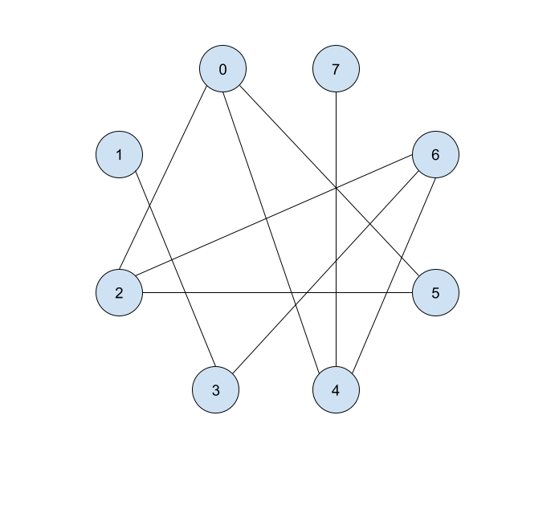

[](https://classroom.github.com/online_ide?assignment_repo_id=4244701&assignment_repo_type=AssignmentRepo)
# Homework 5: Graphs

## Instructions
This homework covers lectures 13 and 14, i.e. graphs and graph traversals. **This
assignment is due on March 4, 2021.**

**This homework requires you to input your PantherID as a string in the
`pantherID` method in `HW5.java`.**

### Submitting This Assignment
In order to complete this assignment, you must make commits of your code to the
`main` branch of this repository. We will take the latest commit as your "final
submission". **Any commits made after the due date will cause the entire
assignment to be [considered late](https://csc4520.org/syllabus/#late-work).**

**If you are unsure how to make commits using Git and GitHub, check out the
[video on Piazza](https://piazza.com/class/kjkot7wwgl53ya?cid=16) from HW0
demonstrating how to use Repl.it to submit your work.**


### Grading and Corrections
This assignment will be graded out of 10 points. The point values of each
problem is listed in the title. We will use automated systems + manual
inspection to assign points in a fair, standardized way.

*If you miss points on this assignment,* there will be an opportunity to earn
them back by doing homework corrections, so don't panic if you're having a tough
time on some of the questions. Check Piazza for details.


### Academic Integrity
Remember that you can consult outside resources and work with other students as
long as you write up your own solutions and cite any links or people you
received help from within `citations.txt`. See
[syllabus/collaboration](https://csc4520.org/syllabus/#collaboration) for
details.


### Getting Help
If you have any trouble with any aspects of the homework, please first check
Piazza to see if anyone else has had a similar issue. The "hw3" tag  on the top
will show only posts relevant to HW3. If you don't find any posts relevant to
you, you can make your own Piazza post.

You can also make an appointment with Andrew or a TA via the [staff
page](https://csc4520.org/staff/) if you want 1-on-1 help.

## Graph Generation
Similar to HW3, you should fill in the `pantherID` method with your Panther ID
as a string. When you hit run on Repl.it, You will receive an autogenerated 
undirected graph.

```
  $ rm HW5.class && javac *.java; java HW5
  Your graph is G = (V, E), where
  V = {0, 1, 2, 3, 4, 5, 6, 7} and
  E = {[(0,2), (0,4), (0,5), (1,3), (2,5), (2,6), (3,6), (4,6), (4,7)]}
```

Answer the following questions with the graph provided.

## Q0: Drawing the Graph (1 point)
Represent your graph as a picture. I recommend using Google Drawings for this.
I've provided [a template](https://docs.google.com/drawings/d/1gqgf8AADY4BI-QfPT6s2kZerxh1YKoXqBN7IvY97H-Q/edit?usp=sharing)
that you can make a copy of and use. Upload your picture as "graph.png" onto
Repl.it/GitHub. For example, the answer to the example
graph would look like this:



## Q1: Adjacency Matrix (1 point)
Represent your graph as an adjacency matrix (2D array of integers). Put your
answer in the `adjMatrix` method. You can verify your answer by running
HW5 (i.e. `java HW5` or "Run" on Repl.it).


## Q2: Adjacency List (1 point)
Represent your graph as an adjacency list (a list of list of integers). Put your
answer in the `adjList` method. You can verify your answer by running
HW5 (i.e. `java HW5` or "Run" on Repl.it). **Assume neighbors are always ordered
from smallest labeled node to largest.**


## Q3: BFS on Graphs (2 points)
Given the following algorithm, what would be the ordering of nodes visited when
we call `bfs(G, 0, 7)`? Put your answer in `bfsOrder`. You can verify your
answer by running HW5 (i.e. `java HW5` or "Run" on Repl.it).

```
  algorithm bfs
    Input: undirected graph G = (V,E), int s and int t
    Output: true if there's a path from s to t; false otherwise

    fringe = Queue of integers
    visited = new boolean array of size |V|
    fringe.add(s)
    visited[s] = true
    while fringe.size() > 0
      currNode = fringe.remove()
      if currNode == t
        return true
      for each neighbor of currNode, starting at the smallest labeled neighbor
        if !visited[neighbor]
          visited[neighbor] = true
          fringe.add(neighbor)
    return false
```

## Q4: DFS on Graphs (2 points)
Given the following algorithm, what would be the ordering of nodes visited when
we call `dfs(G, 0, 7)`? Put your answer in `dfsOrder`. You can verify your
answer by running HW5 (i.e. `java HW5` or "Run" on Repl.it).

```
algorithm dfs
  Input: undirected graph G = (V, E), int s and int t
  Output: true if there's a path from s to t; false otherwise

  visited = new boolean array of size |V|
  return dfsHelper(G, s, t, visited)

algorithm dfsHelper
  Input: undirected graph G = (V, E), int s and int t, and boolean array visited
  Output: true if there's a path from s to t; false otherwise

  visited[s] = true
  if s == t
    return true;
  for each neighbor of s, starting at the smallest labeled neighbor
    if !visited[neighbor] and dfsHelper(G, neighbor, t, visited)
      return true
  return false
```


## Q5: Analysis of BFS (1.5 points)
Provide the worst case time and space complexity of bfs. Make sure to...
* Define your Big-O runtime and space complexity in terms of |V| and |E|. 
* Provide an example of when bfs will take the most number of steps.
* Put your answer in `runtime.txt`.

## Q6: Analysis of DFS (1.5 points)
Provide the worst case time and space complexity of dfs. Make sure to...
* Define your Big-O runtime and space complexity in terms of |V| and |E|. 
* Provide an example of when dfs will take the most number of steps.
* Put your answer in `runtime.txt`.  
