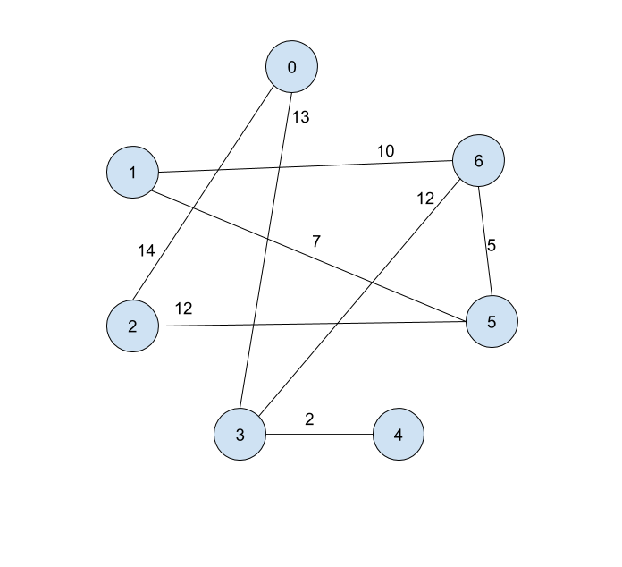

[](https://classroom.github.com/online_ide?assignment_repo_id=4298484&assignment_repo_type=AssignmentRepo)
# Homework 6: Dijkstra's

## Instructions
This covers Lecture 15, i.e. Dijkstra's Algorithm. **It is due on March 12,
2021.** As always, if you have questions, please reach out on Piazza and Office
Hours.

Similar to HW5, we will generate a unique graph (this time as an adjacency
matrix) for you based on your Panther ID. In `HW6.java`, replace `null` in
`pantherID` with a string of your Panther ID.

Then when you compile and run HW6, you should get output that looks similar to
this:
```
$ rm HW6.class; javac *.java; java HW6
Your adjacency matrix:
[null, null,   14,   13, null, null, null]
[null, null, null, null, null,    7,   10]
[  14, null, null, null, null,   12, null]
[  13, null, null, null,    2, null,   12]
[null, null, null,    2, null, null, null]
[null,    7,   12, null, null, null,    5]
[null,   10, null,   12, null,    5, null]

Run Dijktra's starting at node 0
```

## Q0. Drawing
Represent your graph as a picture. I recommend using Google Drawings for this.
I've provided [a template](https://docs.google.com/drawings/d/1VFZ5B8ZqA6BHu4v1hyZekrltXcd3Y71mltjAlDyqnmY/edit?usp=sharing)
that you can make a copy of and use. For example, the answer to the example
graph would look like this: .

Upload your picture
as `graph.png`.


## Q1: Adjacency List
Take the generated adjacency matrix and translate it into an adjacency list. Put
that list in the `adjList` method in `HW6.java`.

For example, the answer for the example graph above would look like this:
```
return Arrays.asList(
  Arrays.asList(pair(2, 14), pair(3, 13)),
  Arrays.asList(pair(5, 7), pair(6, 10)),
  Arrays.asList(pair(0, 14), pair(5, 12)),
  Arrays.asList(pair(0, 13), pair(4, 2), pair(6, 12)),
  Arrays.asList(pair(3, 2)),
  Arrays.asList(pair(1, 7), pair(2, 12), pair(6, 5)),
  Arrays.asList(pair(1, 10), pair(3, 12), pair(5, 5))
);
```

## Q2. Dijkstra's `dist`
Now we manually run Dijkstra's on your graph starting at the node described by
your output ("Run Dijktra's starting at node 0"). Record the changes of `dist`
as you run this algorithm into the `dist` method in `HW6.java`.
* Note that your starting node may be different depending on your Panther ID.
* **Every time you examine an edge (regardless of whether you update `dist`),
you should add a row to your answer.**
* Like in class, we visit the neighbor with the smallest label first.

For example, here is the answer for the example graph:
```
return new int[][] {
  {inf, inf, inf, inf, inf, inf, inf}, // (initial)
  {0, inf, inf, inf, inf, inf, inf},   // (setting dist[s] = 0
  {0, inf, 14, inf, inf, inf, inf},    // (0 <-> 2 edge)
  {0, inf, 14, 13, inf, inf, inf},     // (0 <-> 3 edge)
  {0, inf, 14, 13, inf, inf, inf},     // (3 <-> 0 edge)
  {0, inf, 14, 13, 15, inf, inf},      // (3 <-> 4 edge)
  {0, inf, 14, 13, 15, inf, 25},       // (3 <-> 6 edge)
  {0, inf, 14, 13, 15, inf, 25},       // (2 <-> 0 edge)
  {0, inf, 14, 13, 15, 26, 25},        // (2 <-> 5 edge)
  {0, inf, 14, 13, 15, 26, 25},        // (4 <-> 3 edge)
  {0, 35, 14, 13, 15, 26, 25},         // (6 <-> 1 edge)
  {0, 35, 14, 13, 15, 26, 25},         // (6 <-> 3 edge)
  {0, 35, 14, 13, 15, 26, 25},         // (6 <-> 5 edge)
  {0, 33, 14, 13, 15, 26, 25},         // (5 <-> 1 edge)
  {0, 33, 14, 13, 15, 26, 25},         // (5 <-> 2 edge)
  {0, 33, 14, 13, 15, 26, 25},         // (5 <-> 6 edge)
  {0, 33, 14, 13, 15, 26, 25},         // (1 <-> 5 edge)
  {0, 33, 14, 13, 15, 26, 25}          // (1 <-> 6 edge)
};
```

We'll be using the following Pseudocode for Dijkstra's:
```
algorithm dijkstras
  Input:
    Graph G = (V, E) where each edge (a, b) ∈ E has cost(a, b) > 0
    int s, the label to indicate the source node that we start on
  Output:
    int[] dist where dist[u] = cost of shortest path from s to u
    int[] prev where prev[u] = node label of the previous node on the shortest
      path from s to u

  dist = new int array of size |V|
  prev = new int array of size |V|
  for v in V
    dist[v] = infinity
    prev[v] = null
  dist[s] = 0

  H = new priorty queue of the elements in V, ordered by dist
  while H.size() > 0
    u = deletemin(H)
    for each edge (u, v) in E
      if dist[v] > dist[u] + cost(u, v)
        dist[v] = dist[u] + cost(u, v)
	prev[v] = u
	decreaseKey(H, v, dist[v])

  return dist, prev
```

## Q3. Dijkstra's `prev`
Now we manually run Dijkstra's on your graph. Record the changes of `prev` as
you run this algorithm into the `prev` method in `HW6.java`. **Every time you
examine an edge (regardless of whether you update `prev`), you should add a row
to your answer.** 
```
return new Integer[][] {
  {null, null, null, null, null, null, null}, // (initial)
  {null, null, 0, null, null, null, null},    // (0 <-> 2 edge)
  {null, null, 0, 0, null, null, null},       // (0 <-> 3 edge)
  {null, null, 0, 0, null, null, null},       // (3 <-> 0 edge)
  {null, null, 0, 0, 3, null, null},          // (3 <-> 4 edge)
  {null, null, 0, 0, 3, null, 3},             // (3 <-> 6 edge)
  {null, null, 0, 0, 3, null, 3},             // (2 <-> 0 edge)
  {null, null, 0, 0, 3, 2, 3},                // (2 <-> 5 edge)
  {null, null, 0, 0, 3, 2, 3},                // (4 <-> 3 edge)
  {null, 6, 0, 0, 3, 2, 3},                   // (6 <-> 1 edge)
  {null, 6, 0, 0, 3, 2, 3},                   // (6 <-> 3 edge)
  {null, 6, 0, 0, 3, 2, 3},                   // (6 <-> 5 edge)
  {null, 5, 0, 0, 3, 2, 3},                   // (5 <-> 1 edge)
  {null, 5, 0, 0, 3, 2, 3},                   // (5 <-> 2 edge)
  {null, 5, 0, 0, 3, 2, 3},                   // (5 <-> 6 edge)
  {null, 5, 0, 0, 3, 2, 3},                   // (1 <-> 5 edge)
  {null, 5, 0, 0, 3, 2, 3},                   // (1 <-> 6 edge)
};
```


